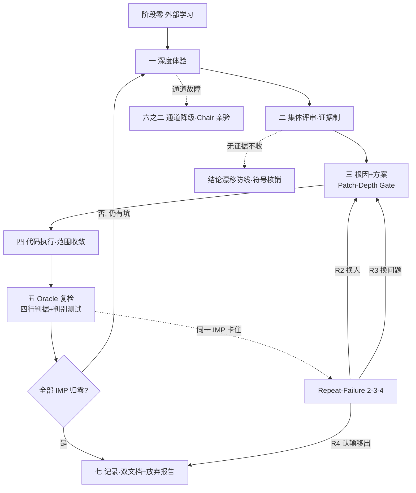

# MaxLoop 魔王系统 v3.1

> **唯一带刹车的多智能体迭代引擎。**

---

## 一句话宗旨

魔王系统是一台「自带刹车」的多智能体迭代引擎，专治一个病——**AI 自我迭代会假收敛**：
一轮接一轮「测试全绿」，问题却还在。

它全部的设计只围绕一句话：

> **「修好了」的判据必须来自模型之外，永远不许模型自己说了算。**

外部命令的真实输出、修复前的失败证据、真实入口的可达性，才是放行标准。

---

## 面向所有人 · 通用 skill（v3.2 定位）

**它不绑定任何项目 / 语言 / 框架。** 你用 Node、Python、Rust、Go，做前端、CLI、库，甚至非代码任务（文档、流程、Prompt 优化），都能直接套——只要你能给出「构建/类型检查命令 + 测试命令 + 版本发布方式 + 推送部署命令」这四样。

**它的价值不只是「高效提升模型性能」——那只是价值之一：**

| 价值 | 一句话 | 量化指标 |
|---|---|---|
| 反假收敛 | 不让「全绿」蒙混过关，真修复和假绿/补丁分开 | 假绿拦截数 |
| 防资源浪费 | 不让同一问题被换马甲来回修 6 轮 | 逃逸触发次数 |
| 结论可复核 | 每份审查结论过符号/行号核销，无证据即废弃 | 结论漂移核销数 |
| 真实 throughput | 只认当轮真正过 Oracle Gate 的修复 | 单轮有效修复数 |

4 个指标的定义与实证见 `references/effectiveness-metrics.md`，每一轮末必须填表。

---

## 它解决什么痛点（为什么存在）

我们在真实项目上烧过 **6 轮**（某弹题识别 bug：0.6.19→0.6.26）。每一轮：

```
358/0 → 373/0 → 397/0 → 413/0 → 421/0   # 每一轮都「全绿」
```

但每一轮都被独立对抗验证员挖出新 P1。同一个缺陷在每一层换个马甲回来。

**失败有学术名字**：我们把 critic（批评者）当成了 oracle（判据）。

- **Huang et al., ICLR 2024**《LLMs Cannot Self-Correct Reasoning Yet》——没有外部判据时让模型自判「修好了没」，收益蒸发。
- **CRITIC（Gou et al., ICLR 2024）**——不要求模型自评，让它调工具，**工具输出才是 critic**。
- **Xu et al., ICLR 2025**——对照实测有 +8% / −1% 混合结果。我们不宣称「魔王系统一定更强」，只是把**风险与刹车显式化**。

**v3.0 就是把 oracle 从模型内部搬到外部。** v3.1 在 v3.0 刹车逻辑不变的前提下，补上了「可落地性」与「宗旨显性化」。

---

## 四件套怎么配合（核心铁链）

```
root-cause-protocol  → 确定「改哪里」（5 Whys + 占位符替换测试，区分真根因 vs 补丁）
discriminating-test  → 证明「改了有效」（baseline 旧代码必红 / candidate 必绿）
oracle-gate          → 禁止「自己说改好了」（a 真跑 / b lint / c 入口可达 / d 修复前失败）
repeat-failure-breaker → 横向管「卡住时何时必须换打法」（R2 换人 / R3 换问题 / R4 认输）
```

> 四件套串行：先问清改哪 → 再证明改动有效 → 然后禁止自判 → 最后在卡住时强制换打法。

---

## 主循环状态机



---

## Chair 每轮执行清单（落地必勾）

任何一项无法勾选 → 不许宣布「项目已无问题」。

| # | 必做项 | 对应协议 | 验收证据 |
|---|---|---|---|
| 0 | 阶段零外部学习已落盘，含「未找到」清单 | SKILL 阶段零 | `best-practices.md` 存在 |
| 1 | 每条评审入清单前完成符号/行号核销，0 命中即废弃 | review-protocol §5 | 核销表在会议记录 |
| 2 | 每个 IMP 过 Patch-Depth Gate（A 出错点 + B 根因，A≠B 同修） | SKILL 铁律9 | 根因落盘 |
| 3 | 每条修复配判别测试：baseline 旧代码必红 + candidate 必绿 | discriminating-test | 两份输出都在 |
| 4 | Oracle Gate 四行表全填（a 真跑 / b lint / c 入口可达 / d 修复前失败） | oracle-gate | 缺任一行打回 |
| 5 | 同一 IMP 累计失败计数，R2/R3/R4 到点强制换打法 | repeat-failure-breaker | stuck 计数在 |
| 6 | 双文档留痕；R4 出结构化放弃报告 | record-keeping | 文件落盘 |
| 7 | 反空转：连续 2 轮全体红点=0 即停，不凑轮数 | SKILL 六 | 不空派 |

---

## 协议清单（13 个文件）

**核心四件套（v3.0 落地）**
- `root-cause-protocol.md` — 5 Whys 根因 + 占位符替换测试
- `discriminating-test.md` — 判别测试（baseline-fails / candidate-passes）
- `oracle-gate.md` — 外部判据先决（最高铁律）
- `repeat-failure-breaker.md` — 2-3-4 逃逸阶梯

**评审与执行**
- `review-protocol.md` — 集体评审（投票制→证据制）+ 结论漂移防线
- `solution-protocol.md` — 方案模板
- `code-exec-protocol.md` — 代码执行规范
- `loop-driver.md` — 复检循环与终止判定
- `degrade-protocol.md` — 通道降级与故障自愈
- `record-keeping.md` — 双文档规范
- `experience-report-template.md` — 深度体验报告模板
- `novel-forge-adapter.md` — novel-forge 产品适配层

---

## 适用 / 不适用

**适用**：已处于「正式版」状态的产品，需要做深度体验、集体评审、迭代修改直至问题归零。
**不适用**：单次小修、纯问答、无代码库的概念讨论。

---

## 安装（作为 WorkBuddy Skill）

```bash
# 方式一：clone 到 WorkBuddy 用户级 skills 目录
git clone git@github.com-huanweide:huanweide/maxloop-overlord.git \
  ~/.workbuddy/skills/maxloop-overlord

# 方式二：下载 ZIP 解压到上述目录
```

放入 `SKILL.md` 可被 WorkBuddy 识别的 skills 路径即生效，无需额外配置。

---

## 版本

| 版本 | 要点 |
|---|---|
| v2.2 | 初版多智能体迭代，烧了 6 轮失控，留下「假收敛」教训 |
| v3.0 | 引入四件套刹车（Oracle Gate / 判别测试 / Patch-Depth / Repeat-Failure）+ 证据制评审 |
| v3.1 | 宗旨显性化 + 主循环状态机图 + Chair 执行清单 + 公开发布到 GitHub |

---

## 许可

本项目为方法论/框架，遵循 MIT（如后续添加 LICENSE 文件）。
