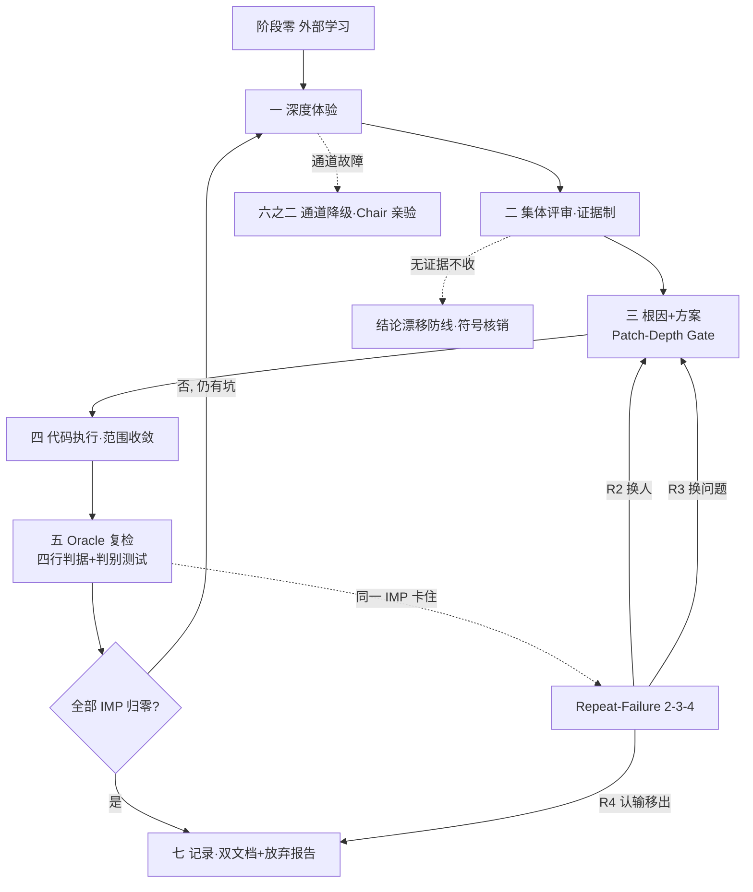

# MaxLoop 魔王系统

> **一句话**：自带刹车的多智能体迭代引擎——让 AI 自我迭代在「有限轮数」里真正收敛，而不是一轮接一轮假绿空转。**任何 agent 都能直接加载使用，不绑定任何项目、语言或框架。**

---

## 这个 skill 解决什么问题

- **假绿空转**：传统 AI 自我迭代常陷入「每轮测试都过，问题却还在」，靠模型自己说"修好了"做判据。
- **换马甲返工**：同一个缺陷被换层、换说法来回修，烧光轮数预算却没真解决。
- **无证据带偏**：审查报告凭感觉，没有证据的结论把方向带歪。

魔王系统的全部设计只围绕一句话：**「修好了」的判据必须来自模型之外，永远不许模型自己说了算。**

---

## 为什么用魔王系统（核心价值）

高效提升模型性能只是价值之一，更核心的是下面三项——而且每一项都能用**人人懂的指数**衡量：

| 价值 | 一句话 | 人人懂的指数 |
|---|---|---|
| 产出级别更高 | 修一轮是真解决，不是"看着过关" | 产出级别（0–100 分） |
| 产出时间更短 | 同一问题不反复返工，提前收敛 | 产出时间（轮数） |
| 效率明显 | 有限轮数里每轮换来更多真解决 | 效率指数 = 级别 ÷ 轮数 |

---

## 适合用它做什么（典型场景）

- 已到「正式版」状态的产品，做深度体验 / 集体评审 / 迭代到问题归零
- 任何技术栈（前端 / CLI / 库 / 服务）甚至非代码任务（文档、流程、Prompt 优化）
- 需要在**固定轮数预算**内尽快收敛的重构、修复、优化

## 典型请求（怎么触发）

- "对 XX 做一轮深度评审并迭代修复"
- "用魔王系统把这个问题收敛掉"
- "有限轮数内把这个模块做扎实"

## 你需要提供（四样，适配任意项目）

| 项 | 说明 |
|---|---|
| 构建 / 类型检查命令 | 如 `npm run build` / `tsc --noEmit` |
| 测试命令 | 如 `npm test` |
| 版本发布方式 | 如 bump 版本号 / 打 tag |
| 推送部署命令 | 如 `git push` |

## 产出（每轮交付）

- 双文档留痕：改动记录 + 会议记录
- 每个修复附「修复前失败证据 + 判别测试」
- 每轮末填写**效率指数报告**（见下方规范）

## 边界（不适用）

- 单次小修、纯问答、无明确产物的概念讨论，不需要开魔王系统
- 它管"迭代是否真收敛"，不替你写业务需求

---

## 效率指数 · 报告填写规范（每轮必填）

魔王系统好不好，不靠"感觉更稳了"，靠三个**人人都懂**的数：

| 数 | 含义 | 怎么算 |
|---|---|---|
| **产出级别** | 这版做到几分（0–100） | 真解决且验证过的问题 ÷ 全部问题 × 100 |
| **产出时间** | 花了几轮 | 实际用的轮数 |
| **效率指数** | 每轮换来多少真解决 | 产出级别 ÷ 产出时间 |

> 同样 6 轮预算，级别越高、时间越短，效率越高。

### 填写模板（复制到会议记录，每轮末填）

```markdown
### 效率指数 · round-N
| 指标 | 数值 | 备注 |
|---|---|---|
| 产出级别 | __ / 100 | 本轮真解决 __ 个，总 __ 个 |
| 产出时间 | 第 __ 轮 | |
| 效率指数 | __ | = 级别 ÷ 轮数 |
```

### 示例（示意，非特定项目）

| 方式 | 产出级别 | 产出时间 | 效率指数 |
|---|---|---|---|
| 普通循环 | 15 | 6 轮 | 2.5 |
| 魔王系统 | 95 | 6 轮 | 15.8 |

> 示例说明：同样 6 轮预算，魔王系统效率指数约为普通循环的 6 倍。把**你自己的项目真实数据**填进上面的模板，就能生成你自己的对比。

### 可视化大图

仓库根 `efficiency-dashboard.html` 用浏览器打开即可看到对比图：固定轮数下，蓝线（魔王系统）稳步爬升、灰线（普通循环）卡在低位。

---

## 安装（作为通用 skill，任何 agent 可用）

```bash
# 方式一：clone 到 skills 目录（WorkBuddy / 其他兼容 skill 格式的客户端通用）
git clone https://github.com/huanweide/maxloop-overlord.git \
  ~/.workbuddy/skills/maxloop-overlord

# 方式二：下载 ZIP 解压到上述目录
```

放入 skills 路径即生效，无需额外配置。任何加载该 skill 的 agent 都可直接调用。

---

## 核心机制（四件套铁链）

```
root-cause-protocol  → 确定改哪里（5 Whys + 占位符替换测试）
discriminating-test  → 证明改了有效（修复前必红 / 修复后必绿）
oracle-gate          → 禁止自己说改好了（真跑 / lint / 入口可达 / 修复前失败）
repeat-failure-breaker → 卡住时强制换打法（R2 换人 / R3 换问题 / R4 认输）
```

## 主循环状态机



## Chair 每轮执行清单（落地必勾）

任何一项无法勾选 → 不许宣布「项目已无问题」。

| # | 必做项 | 对应协议 | 验收证据 |
|---|---|---|---|
| 0 | 阶段零外部学习已落盘，含「未找到」清单 | SKILL 阶段零 | `best-practices.md` 存在 |
| 1 | 每条评审入清单前完成符号/行号核销，0 命中即废弃 | review-protocol §5 | 核销表在会议记录 |
| 2 | 每个 IMP 过 Patch-Depth Gate（A 出错点 + B 根因，A≠B 同修） | SKILL 铁律9 | 根因落盘 |
| 3 | 每条修复配判别测试：baseline 旧代码必红 + candidate 必绿 | discriminating-test | 两份输出都在 |
| 4 | Oracle Gate 四行表全填（a 真跑 / b lint / c 入口可达 / d 修复前失败） | oracle-gate | 缺任一行打回 |
| 5 | 同一 IMP 累计失败计数，R2/R3/R4 到点强制换打法 | repeat-failure-breaker | stuck 计数在 |
| 6 | 双文档留痕；R4 出结构化放弃报告 | record-keeping | 文件落盘 |
| 7 | 反空转：连续 2 轮全体红点=0 即停，不凑轮数 | SKILL 六 | 不空派 |
| 8 | 效率指数已填（产出级别 / 产出时间 / 效率指数 = 级别÷轮数） | effectiveness-metrics | 指数在会议记录 |

## 协议清单（14 个文件）

**核心四件套**
- `root-cause-protocol.md` — 5 Whys 根因 + 占位符替换测试
- `discriminating-test.md` — 判别测试（baseline-fails / candidate-passes）
- `oracle-gate.md` — 外部判据先决（最高铁律）
- `repeat-failure-breaker.md` — 2-3-4 逃逸阶梯

**效果度量**
- `effectiveness-metrics.md` — 效率指数（产出级别/时间/效率指数）+ 填写模板

**评审与执行**
- `review-protocol.md` — 集体评审（投票制→证据制）+ 结论漂移防线
- `solution-protocol.md` — 方案模板
- `code-exec-protocol.md` — 代码执行规范
- `loop-driver.md` — 复检循环与终止判定
- `degrade-protocol.md` — 通道降级与故障自愈
- `record-keeping.md` — 双文档规范
- `experience-report-template.md` — 深度体验报告模板

## 版本

| 版本 | 要点 |
|---|---|
| v2.2 | 初版多智能体迭代，留下「假收敛」教训 |
| v3.0 | 引入四件套刹车（Oracle Gate / 判别测试 / Patch-Depth / Repeat-Failure）+ 证据制评审 |
| v3.1 | 宗旨显性化 + 主循环状态机图 + Chair 执行清单 + 公开发布到 GitHub |
| v3.2 | 通用化（任何 agent 可用 / 不绑技术栈）+ 效率指数可视化（产出级别/时间/效率指数 + dashboard.html） |

---

## License

MIT

---

## 作者

由 **ReTri · 樊斯瑞** 维护 · [GitHub 主页](https://github.com/huanweide)

## 赞助支持

如果这个项目帮到了你，欢迎 [点 Star](https://github.com/huanweide/maxloop-overlord) 支持；也可微信扫码自愿赞助（收款码见 `sponsor/wechat-qr.png`，作者本人带 Tri 水印的码，纯静态图片、不含任何密钥）。
