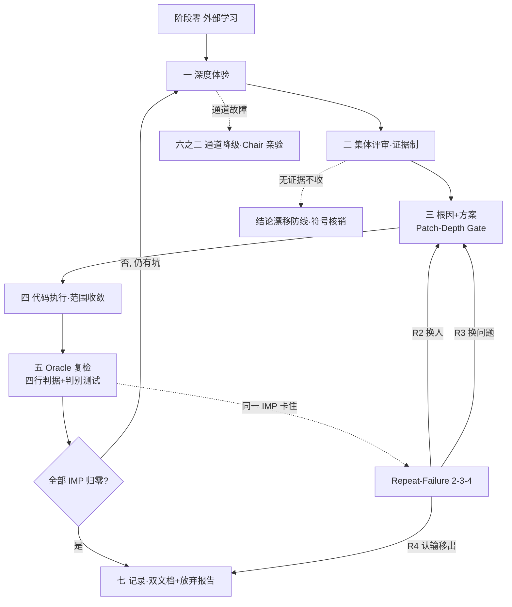

# MaxLoop 魔王系统 v3.2 · 唯一带刹车的多智能体迭代引擎

> **宗旨（一句话）**：魔王系统是一台「自带刹车」的多智能体迭代引擎，**面向所有人的通用 skill（不绑定任何项目 / 语言 / 框架）**，专治一个病——**AI 自我迭代会假收敛**（一轮接一轮「全绿」，问题却还在）。它全部的设计只围绕一句话：**「修好了」的判据必须来自模型之外，永远不许模型自己说了算。** 外部命令的真实输出、修复前的失败证据、真实入口的可达性，才是放行标准。根因协议 → 判别测试 → Oracle Gate → 重复失败打破器，四件套串成一条铁链，把"高效执行"和"不假绿、不空转、不无脑重试"同时焊死。

## 零、为什么是 v3.0（先读这段，否则会重蹈覆辙）

v2.2 在真实项目上烧了 **6 轮**（某弹题识别 bug：0.6.19→0.6.26）。每一轮：

- 实现员交差 → 测试全绿（358/0 → 373/0 → 397/0 → 413/0 → 421/0）→ **每一轮都是「全绿」**
- 对抗验证员每轮都挖出新 P1 → 修 → 下轮又挖出新的 → **同一个 bee（自定义 DOM 识别）在每一层都换个马甲回来**

**失败模式有学术名字**：我们把 critic 当成了 oracle。
Huang et al., ICLR 2024《LLMs Cannot Self-Correct Reasoning Yet》——**没有外部判据时让模型自判"修好了没"，收益蒸发**。
CRITIC（Gou et al., ICLR 2024）立场最诚实：不要求模型自评，让它**调工具，工具输出才是 critic**。

**v3.0 就是把 oracle 从模型内部搬到外部。新增铁律 8~11 专治这件事。**

> 诚实边界：并非所有自我迭代都有效。Xu et al. ICLR 2025 的对照实测报告过 +8% / −1% 的混合结果——单_agent-single loop 在已有强模型时**并不总是占优**。我们不宣称「魔王系统一定更强」，只是把**风险与刹车显式化**。

---

## 一、定位与触发

用于对已处于「正式版」状态的产品做深度迭代。触发条件与 v2.2 相同（用户明确要求 / 提供正式版产品 / 希望固化为循环）。

**非触发**：单次小修、纯问答、无代码库的概念讨论。

---

## 二、核心铁律（不可违背）

1. **最高执行权限**：判定「已无问题」前无需请示、无需追问，持续驱动直至自动停止。
2. **资源预算意识**：心细优先于省钱，但禁止为「凑轮数」而派发（见「反空转刹车」）。
3. **Trust but verify（Chair 亲验）**：必须亲自读 `git diff` + 跑质量门禁，不轻信 "已完成"。并行 Agent 各自跑门禁会互看对方未完成文件，必须等全部写入后由 Chair 单跑。
4. **双文档留痕**：改动记录 + 会议记录。
5. **诚实边界**：所有发现须基于真实证据；禁止编造。**查不到的数据写「未找到」，绝不填数**（尤其 benchmark 类，要公开）。
6. **主代理不扮演（防假派）**：评审报告必须由真实子代理产出，Chair 只做汇总/派发/亲验。通道故障时按「六之二」降级并在会议记录显式标注。
7. **批次编排（防过载）**：开会/执行 Agent 一律分批，**单批 ≤5**，本批全部返回后才派下一批。积压过的实践：并行过多导致子代理通道空转、报告不落盘。

### ★ v3.0 新增四条（本次事故直接产物）

8. **Oracle Gate（外部判据先决）★ 最高**
   「修好了」的判据**只允许来自模型之外**，禁止以「reviewer 认可 / diff 看着合理 / 我自己判断」为准。
   放行必须同时具备：
   - (a) 目标命令**真实执行并贴输出**（不是"应该能过"）
   - (b) lint/类型检查在**改动文件**上跑过
   - (c) **真实入口可达性验证** —— v2.2 第 3 轮漏的正是这条：**单元测试全绿 ≠ 用户实际路径可达**（测试绕过路由层直接调底层函数，是本项目最贵的教训，累计贡献 3 轮无效返工）
   - (d) 若声称修复某个 bug：**给出该 bug 在修复前的失败输出**（见第九条判别测试）

9. **Patch-Depth Gate（补丁层级闸门）★ 专治「加黑名单→加打分」**
   任何修复提案，**缺 B 段不许落地**：
   - **A 段 = 出错点**：精确到 `文件:行号`
   - **B 段 = 根因**：设计/约定层的成因（不是现象）
   - **A ≠ B 则两者必须同修**。自检句：「只修 B，这问题还会再出现吗？」答「会」→ 没找到根因，重写。
   - 反面例子：把「API 返 500」当根因是不够的；**「重试没退避，且错误分支返回伪造默认值而不是大声失败」**才是。

10. **No-Progress Guard（同签名重复检测）**
    同一 `(工具, 参数, 错误三元组)` 或「同一族验证结论在同一处再次出现」连续 **2 次** → **立即中止当前策略，不许第 3 次**。
    常见的休息 Rush 误把「循环限制」当刹车——LangGraph 默认 `recursion_limit=25`、LangChain 默认 `max_iterations=15` **只限总步数，看不见"每一步都一样"**，那是预算烧完后的兜底，把卡死运行变成浪费运行。

11. **Repeat-Failure Breaker（2-3-4 逃逸阶梯）★ 用户主诉求**
    见「六之三」。口诀：**R2 换人 + 讨论，R3 换问题 + 搜索，R4 认输换战线。**

---

## 三、主循环（七阶段）

| 阶段 | 名称 | 核心动作 |
|---|---|---|
| **零** | **外部学习**★新增 | 开工前先搜：市面同类产品、开源实现、所属平台公开资料。**不许闭门造车** |
| 一 | 深度体验 | 分批派开会子 Agent（≤5/批）写深度报告 |
| 二 | 集体评审 | 收敛改进清单（**已改为证据制**，见下） |
| 三 | 根因 + 方案 | 每条必须过 Patch-Depth Gate |
| 四 | 代码执行 | 限定可改文件集合（范围收敛） |
| 五 | Oracle 复检 | 跑外部判据 + 判别测试 |
| 六 | 逃逸判定 | Repeat-Failure Breaker 计分，触发则讨论/pivot/降级 |
| 七 | 记录 | 双文档 + **放弃报告**（如需） |

### 主循环状态机图（七阶段 + 逃逸 + 刹车 一张总图）



> 看图说话：主循环顺时针转（阶段零→一→二→三→四→五→七），阶段五复检发现新坑就回到阶段一继续；同一 IMP 卡住就走右侧逃逸阶梯（R2/R3/R4）；评审无证据走结论漂移防线，体验通道故障走降级。

### 阶段零：外部学习（v3.0 新增·不可跳过）

动手写代码之前必须完成，输出落到 `PROCESS/research-<topic>/`：
1. 搜 GitHub 同类实现，逐项对照「我们缺什么」
2. 搜目标平台/领域的公开资料与已知坑
3. 产出 `best-practices.md`，含**可抄机制清单** + **明确「未找到」清单**（诚实边界）

> 动机：`karpathy/autoresearch` 的启示——**固定预算与范围使结果可比**。我们 6 轮失控，部分原因是从未先看清别人怎么做。

### 阶段二：评审改「证据制」

**v2.2 的「过半数投票」在只有 1-2 个评审 Agent 时形同虚设**（1 票即 100%，却走了全套开会仪式）。v3.0 改为：

- **票数 → 证据强度**：只要给出**可复现的证据**（失败输出/文件行号/运行时现象），单票即列 P1；无证据的一律不收（不论几票）。
- 保留「观察池」，下轮复核，不因数人未通过而永久丢弃。

---

## 四、角色与编排

- **开会子 Agent**：只读诊断，必须真实 spawn。**透镜不重叠、且必须可行动**（禁止派"泛泛而谈"的占位 Agent）。Web/桌面项目真截图 + 点按钮；CLI/库项目降为命令链路 + 边界测试，**禁止给无 UI 项目硬造假截图**。
- **Chair**：汇总、派发、**亲验**（读 diff + 跑门禁）、对汇报事项做最终决策。
- **代码执行 Agent**：按方案改码；**只能改「本次允许改动的文件集合」内的文件**（见阶段四范围收敛）。

---

## 五、产品适配层

用户提供四项：构建/类型检查命令、测试命令、版本发布方式、推送部署命令。

---

## 六、高效原则（避免派无用 Agent）

1. **视角休眠**：某视角连续 2 轮红点 = 0，暂停派出；跨视角问题出现即唤醒。
2. **适配即降级**：无 UI 项目不派截图类视角。
3. **透镜不重叠且可行动**。
4. **反空转刹车**：连续 2 轮全体红点 = 0 → 停止，不为凑轮数硬派。
5. **范围收敛（v3.0 新增）**：阶段四开始前先声明**本次允许改动的文件集合**。超出集合须先开工参会批准。
   > 依据 `karpathy/autoresearch`：agent 只能改一个文件、每实验固定 5 分钟。

## 六之二、通道降级与故障自愈（防卡死）

子代理通道可能失效（返回空、报告不落盘）。自愈流程：

1. **派发后必校验**：返回内容非空 + 报告已落盘 `PROCESS/meetings/round-N/<agent>.md`。任一不满足记一次失败。
2. **单次失败重试 1 次**（仍受 ≤5 约束）。
3. **连续 2 次失败 → 判定通道故障，立即降级**，不得空等、不得卡死、不得假装产出。
4. **降级模式**：Chair 亲自按透镜读源码/跑测试，产 `round-N/chair-self-audit.md`；会议记录首行标注「本轮为 Chair 亲验，非子代理独立产出」。
5. **降级不计入假收敛**：防假收敛规则同样生效。
6. **每轮起点轻量探测**：先派 1 个轻量子代理，成功则恢复真实 spawn。
7. **根因与修复（2026-08-14 已定位）**：空返回根因是 `AgentModelResolver` 给内置子代理解析不到模型（日志：`agent "general-purpose" original_models=[] -> resolved_models=[]`）。修复：在 `%USERPROFILE%\.workbuddy\agents\` 建自定义 agent 文件，frontmatter 含 `model: <可用模型 id>` 与 `tools: "*"`。**模型选择铁律**：优先 WorkBuddy 平台模型（如 `deepseek-v4-flash`，走积分）；勿用 `models.json` 自定义模型（实测 key 无效致认证失败空返回）。生效判据：日志出现 `original_models=["deepseek-v4-flash"]`。
8. **超时自查**：派发后设等待上限 2-3 分钟，超时即停止空耗，做三步自查（落盘校验 → 查会话日志关键行 → curl 直测模型连通性），再按 3/4 处理。

## 六之三、Repeat-Failure Breaker（2-3-4 逃逸阶梯）★ 核心新增

> 用户原话：「如果一直卡同一个问题 2 次解决不了，则一起讨论该问题究竟为什么……如果依旧有这个问题，则跳过此问题，一起思考是不是有其他方案（讨论+搜索），如果依旧觉得失败或者不行，则跳过这个问题去解决别的优化点。」

**实现办法：给每个 IMP 条目挂一个 `stuck` 计数器（劝退牌），跨轮累加。**

| 累计失败 | 阶段 | 强制动作 | 禁止做的事 |
|---|---|---|---|
| **1** | 正常路径 | 修 A + B（Patch-Depth Gate） | — |
| **2** | **★讨论（换人）** | **停止写代码**。跑 5 Whys；**更换主责角色**（换模型 / 换身份卡，不是换措辞）；写《为什么两次都没成功》 | ❌ 不许直接改同名 hoe 第三遍 |
| **3** | **★Pivot（换问题）** | **强制改写问题陈述本身**（例：全树猜测 → 按位置锚定）。先用阶段零式搜索找替代方案，三选一：换手 / 换模型 / 换抽象层级 | ❌ 不许沿用同一表述 |
| **4** | **★降级（换战线）** | 交结构化《放弃报告》，目标从「修好」降为「说清为什么做不到」；**标记 KNOWN-LIMITATION 并移出清单，转下一个优化点** | ❌ 不许静默重试，也不许继续碰它 |

**实现位置建议：钩子层（PreToolUse），不是 Prompt 层。**
理由：「这是第 7 次了」这个模式**跨 turn 分布**，模型在循环内部看不见它——看得见的是循环外面的计数器。

### 《放弃报告》模板（M7 Termination-Duty）
```markdown
## <IMP-xxx> 放弃报告
- **试过的路径**：①…②…③…（每条附失败证据）
- **每次失败的可复现输出**：…
- **当前最佳解 / 兜底方案**：…
- **为什么我们认为它不适合继续迭代**：…
- **建议人类下一步**：…
```
不许静默退出，也不许无限重试。

### 连带检测
- **Diff-Stagnation**：连续两轮 diff 很小 + 触及文件集合几乎相同 + 验证结论同类 → 判为**震荡而非收敛**，直接推到上述阶梯 R3。
- **Escalation Ladder**：验证员连续 2 轮在同族位置发现同类问题（非新问题）→ 升级为「冻结、要求重做方案」，而不是继续追加补丁清单。

## 六之四、判别测试（借鉴 `ruvnet/ruflo` Dream Cycle）

> **这是 v2.2 最缺的一环，也是本次事故的直接解药。**

**要求：任何声称「修好了」的测试，必须能在修复前的代码上失败。**

操作协议：
1. 写测试 → **先跑到旧代码上，贴出失败输出**（baseline-fails）
2. 改代码 → 再跑，贴出通过输出（candidate-passes）
3. **两者缺一不可**；若测试在旧代码上也通过 → 该测试**无效**（它没锁住任何东西），重写

> v2.2 累计出现多次「测试全绿但问题依旧」的根因：能写测试的箭头答案是别人给的，却从没被要求先证明这个答案在原代码上确实会失败。

---

## 七、终止条件（自动停止）

同时满足：
1. 本轮所有开会子 Agent 汇报完毕（分批则所有批次齐活）。
2. 各报告问题全部解决（残留 = 0），**含 KNOWN-LIMITATION 已显式交接的条目**。
3. 改进清单归零（每条都**过了 Oracle Gate + 判别测试**）。

未满足则继续，但**受 Repeat-Failure Breaker 与「反空转刹车」双重约束**：不为凑轮数硬派。

---

## 七之二、Chair 每轮执行清单（落地必勾）

把散落各协议的「必做项」收敛成一张可勾选清单。**任何一项无法勾选 → 不许宣布「项目已无问题」。**

| # | 必做项 | 对应协议 | 验收证据 |
|---|---|---|---|
| 0 | 阶段零外部学习已落盘，含「未找到」清单 | SKILL 阶段零 | `best-practices.md` 存在 |
| 1 | 每条评审入清单前完成符号/行号核销，0 命中即废弃 | review-protocol §5 | 核销表在会议记录 |
| 2 | 每个 IMP 过 Patch-Depth Gate（A 出错点 + B 根因，A≠B 同修） | SKILL 铁律9 | 根因落盘 |
| 3 | 每条修复配判别测试：baseline 旧代码必红 + candidate 必绿 | discriminating-test | 两份输出都在 |
| 4 | Oracle Gate 四行表全填（a 真跑 / b lint / c 入口可达 / d 修复前失败） | oracle-gate | 缺任一行打回 |
| 5 | 同一 IMP 累计失败计数，R2/R3/R4 到点强制换打法 | repeat-failure-breaker | stuck 计数在 |
| 6 | 双文档留痕；R4 出结构化放弃报告 | record-keeping | 文件落盘 |
| 7 | 反空转：连续 2 轮全体红点=0 即停，不凑轮数 | SKILL 六 | 不空派 |
| 8 | 效率指数已填（产出级别 / 产出时间 / 效率指数 = 级别÷轮数） | effectiveness-metrics | 指数在会议记录 |

---

## 七之三、效率指数（v3.2 新增 · 谁都能看懂的提升证明）

**核心主张**：魔王系统的价值**不止于「高效提升模型性能」**——那只是价值之一。它更核心的是在**有限轮数**里把事真做成：

- **产出级别更高**：同样修一轮，是真解决（带修复前失败证据）还是假过关，级别天差地别
- **产出时间更短**：同一问题不再被换马甲来回修，提前收敛
- **效率指数 = 产出级别 ÷ 产出时间**：固定轮数预算下，每轮换来多少"真解决"

> 一张图看懂：见 **`references/effectiveness-metrics.md`** 与仓库根 `efficiency-dashboard.html`（浏览器打开即可视化大图）。每轮末填 3 个数（级别 / 轮数 / 指数）落到会议记录——**这是 v3.2 的实质升级，不是文案**。

---

## 八、Resources

### 核心协议（v3.0 四件套 · 均已落地）
- `references/oracle-gate.md` — **外部判据先决条款**：什么算数、什么不算数（最高铁律）
- `references/root-cause-protocol.md` — **5 Whys 根因协议** + ★ 占位符替换测试（区分真根因 vs 补丁）
- `references/repeat-failure-breaker.md` — **2-3-4 逃逸阶梯**：R2 换人 / R3 换问题 / R4 认输移出
- `references/discriminating-test.md` — **判别测试**（baseline-fails / candidate-passes）

> 四件套串行关系：`root-cause` 定改哪里 → `discriminating-test` 证改动有效 → `oracle-gate` 禁止自判修好；
> `repeat-failure-breaker` 横向管"什么时候必须换打法"。
>
> **2026-09-19 实证**：在 zhihuishu-helper 用这套流程修 C06（LLM 返回 HTML 导致 JSON.parse 炸），
> 产出 baseline 23 条全红 / candidate 444 全绿的双向判据，并核销掉一份 review 报告里 8 条结论漂移。
> 另见 `references/review-protocol.md` 第五节「结论漂移防线」。

### 沿用 v2.2
- `references/experience-report-template.md` — 深度体验报告模板
- `references/review-protocol.md` — 评审与改进清单（**投票制已改证据制**）
- `references/solution-protocol.md` — 方案模板
- `references/code-exec-protocol.md` — 代码执行规范
- `references/loop-driver.md` — 复检循环与终止判定
- `references/degrade-protocol.md` — 通道降级
- `references/record-keeping.md` — 双文档规范
- `references/novel-forge-adapter.md` — novel-forge 适配层

---

## 九、version 变更摘要（v2.2 → v3.0）

| 变更 | 类型 | 动机 |
|---|---|---|
| 阶段零「外部学习」 | 新增 | 不许闭门造车；6 轮失控部分源于没先看别人怎么做 |
| Oracle Gate | 新增·最高 | 第 3 轮「单测全绿但入口不可达」直接从 mvp 层被放过 |
| Patch-Depth Gate (A+B) | 新增 | 我们在同一层加了 5 轮补丁（黑名单→打分→过滤），从没人问根因 |
| No-Progress Guard | 新增 | 「限步数」不是刹车——看不见每一步都一样 |
| Repeat-Failure Breaker 2-3-4 | 新增·用户主诉求 | 同一 bee 连修 6 轮，缺 exit valve |
| 判别测试 | 新增 | 测试能绿却锁不住任何东西，多次导致假收敛 |
| 投票制 → 证据制 | 修正 | 1-2 个 Agent 时投票是纯仪式成本 |
| 范围收敛 | 新增 | 改动文件集合无限 = 失控温床 |

---

## 十、version 变更摘要（v3.0 → v3.1 · 2026-09-20）

本版为「深度优化 + 公开发布」版：**未改刹车逻辑，只补「可落地性」与「宗旨显性化」**。

| 变更 | 类型 | 动机 |
|---|---|---|
| 宗旨段（开头一句话点明是什么/解决什么/核心信条） | 新增 | 之前散落多段，外人/新 Chair 一眼看不懂它到底是什么 |
| 主循环状态机图（Mermaid） | 新增 | 七阶段+逃逸+刹车分散在 12 个文件，缺一张总图串联 |
| Chair 每轮执行清单 | 新增 | 把散落各协议的「必做项」收敛成可勾选 checklist，落地即用 |
| Oracle Gate d 判据 ↔ 判别测试 显式互指 | 修正 | 两者关系只提了一句，现明确「d = discriminating-test 的 baseline FAIL 证据」 |
| 发布至 GitHub（huanweide/maxloop-overlord） | 新增 | 让这套方法论可分享、可版本化、可被他人复用 |

---

## 十一、version 变更摘要（v3.1 → v3.2 · 2026-09-20）

本版为「通用化 + 效率指数可视化」版：**确认它是面向所有人的通用 skill（不绑定任何项目/语言/框架），并把「提升作用」做成谁都能看懂的指数——产出级别 / 产出时间 / 效率指数，配可视化仪表盘。**

| 变更 | 类型 | 动机 |
|---|---|---|
| frontmatter description 改写 | 修正 | 明确"面向所有人的通用 skill"与"高效提升模型性能只是价值之一" |
| 宗旨段补「面向所有人通用」 | 新增 | 一上来就讲清它不绑定任何技术栈 |
| 定位段明确「通用 skill」 | 修正 | 适用任何语言/框架/平台，触发条件不变 |
| 效率指数小节（七之三）+ effectiveness-metrics.md + efficiency-dashboard.html | 新增·实质 | 用产出级别/产出时间/效率指数（人人懂）具象提升作用，配可视化大图 |
| Chair 清单加「效率指数已填」项 | 新增 | 把指数纳入落地必勾 |
| 实证基底（v2.2 vs v3.0 真实数据） | 新增 | 用 zhihuishu-helper 真实数据证明价值，非编造 |
